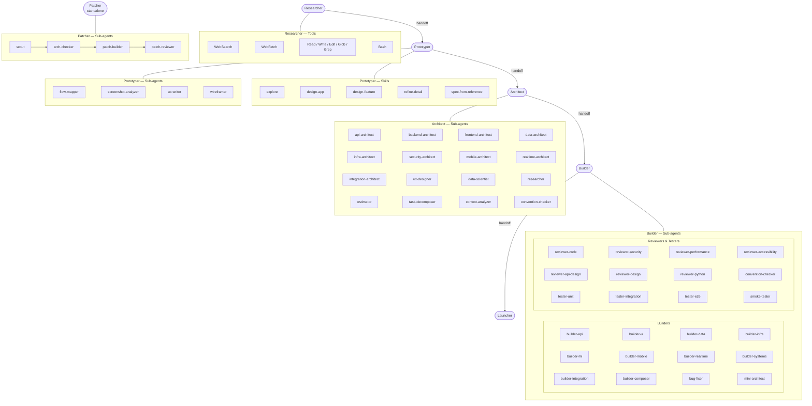

# ccmax-agents

A 6-agent system that takes a software product from idea to deployed code using Claude Code. Five agents form the main pipeline; the sixth (Patcher) is a fast-track shortcut for small changes. Each pipeline agent hands off to the next via an explicit JSON file that you review before proceeding.

---

## Overview

```
Researcher (optional)
     │
     ▼
Prototyper  ──handoff──►  Architect  ──handoff──►  Builder  ──handoff──►  Launcher

Patcher (standalone — fast track for small changes, bypasses the pipeline)
```

| Agent | Role |
|---|---|
| **Researcher** | Market research, competitor analysis, technical deep-dives |
| **Prototyper** | Vision, user stories, wireframes, design constraints |
| **Architect** | Stack, data model, API contracts, task graph |
| **Builder** | Code implementation via specialized sub-agents |
| **Launcher** | Local verification, PR, preview deploy, production, release notes |
| **Patcher** | Fast-track for small changes (≤ 4 files). Assess → Scout → Arch-check → Build → Review → PR |

**Handoffs are explicit.** Each agent produces a JSON file listing what it made, what decisions it took, and what questions remain open. You review and approve before the next agent starts. Nothing runs behind your back.

---

## Agent Graph



---

## Prerequisites

- [Claude Code CLI](https://docs.anthropic.com/en/docs/claude-code) — installed and authenticated
- Python 3 — for dashboard server and metrics scripts
- Git — projects must be git repositories before init
- Node.js / npm — for JS/TS projects (Launcher runs `npm run build`)

---

## Installation

Clone this repo to a stable location on your machine:

```bash
git clone https://github.com/saviranta/ccmax-agents.git ~/agents-max
```

That path (`~/agents-max`) is what you'll reference when running the init and utility scripts.

---

## Quick Start

### 1. Initialize a project

In any Claude Code session, run:

```
/max-init
```

This walks you through setup conversationally — one question at a time:
1. **Mode** — `new` (blank project) or `adopt` (existing codebase)
2. **Project path/name** — new projects go into `ClaudeProjects/<name>`, adopt mode takes a path
3. **Description** — one-line project description
4. **Network domains** — any domains beyond the defaults (github.com, npmjs.org, registry.yarnpkg.com)

It creates the full `.max-agents/` and `.claude/` directory structure, config files, and (in adopt mode) a baseline snapshot of the existing codebase.

> **Legacy alternative:** The bash script `bash ~/agents-max/scripts/max-agents-init.sh` still works but the `/max-init` skill is the recommended approach.

### 2. Validate the setup

```bash
bash ~/agents-max/scripts/validate.sh /path/to/project
```

Prints `PASS` or `FAIL` for each check.

### 3. Run agents in sequence

From your project directory, launch each agent using the runner script:

```bash
SCRIPTS=~/Library/CloudStorage/Dropbox/ClaudeFolder/agents-max/scripts

bash $SCRIPTS/run-agent.sh researcher     # optional — research first
bash $SCRIPTS/run-agent.sh prototyper     # define the product
bash $SCRIPTS/run-agent.sh architect      # design the system
bash $SCRIPTS/run-agent.sh builder        # build the code
bash $SCRIPTS/run-agent.sh launcher       # ship it

# Or for small changes — skip the pipeline:
bash $SCRIPTS/run-agent.sh patcher       # fast track
```

Or launch directly with `--append-system-prompt`:

```bash
AGENTS=~/Library/CloudStorage/Dropbox/ClaudeFolder/agents-max/agents

claude --append-system-prompt "$(cat $AGENTS/researcher/CLAUDE.md)"             # optional
claude --append-system-prompt "$(cat $AGENTS/prototyper/CLAUDE.md)" --model opus
claude --append-system-prompt "$(cat $AGENTS/architect/CLAUDE.md)" --model opus
claude --append-system-prompt "$(cat $AGENTS/builder/CLAUDE.md)" --model opus
claude --append-system-prompt "$(cat $AGENTS/launcher/CLAUDE.md)" --model sonnet

# Fast track for small changes:
claude --append-system-prompt "$(cat $AGENTS/patcher/CLAUDE.md)" --model opus
```

Each agent reads the previous handoff automatically. Each produces a handoff for the next agent to read.

---

## What Gets Created in Your Project

After init, a `.max-agents/` directory lives inside your project:

```
<your-project>/
├── .max-agents/
│   ├── config.json          # project name, root path, stack, created_at
│   ├── state.json           # current pipeline stage and milestone
│   ├── handoffs/            # JSON handoff files between agents
│   ├── artifacts/
│   │   ├── prototyper/      # vision, user stories, wireframes
│   │   ├── architect/       # ADRs, data model, API contracts, task graph
│   │   ├── builder/         # run report, build index
│   │   ├── launcher/        # verification, deploy, and release logs
│   │   └── patcher/         # patch logs, escalations, architect consults
│   ├── audit-log/           # append-only event log
│   └── checkpoints/         # point-in-time snapshots
└── .claude/
    ├── settings.json        # tool permissions and network allowlist
    └── CLAUDE.md            # project instructions loaded into every agent session
```

Nothing from agents-max itself is written into your project beyond the init output.

---

## Agent Detail

### Researcher
Finds information — web search, documentation, competitor analysis — and writes structured reports. Can be called interactively or autonomously by other agents when they hit a knowledge gap.

### Prototyper
Defines the product. Always interactive. Five skills:

| Skill | Use |
|---|---|
| Explore | Open-ended ideation |
| Design App | Full product: vision → stories → wireframes → constraints |
| Design Feature | Same, scoped to one feature in an existing product |
| Refine Detail | Iterate on a specific artifact |
| Spec from Reference | Produce a spec from screenshots or a URL |

### Architect
Designs the system. Three explicit pause gates where you approve before it continues:
1. Stack selection
2. Architecture review (data model, API contracts, ADRs)
3. Task graph review (every task, its dependencies, its assigned sub-agent)

### Builder
Implements the task graph. Dispatches specialized sub-agents in parallel — frontend, backend, data, API, infrastructure, testing, review — respecting the dependency graph. You set a target milestone (`mvp`, `v1`, `v2`) and it stops when the boundary is reached.

**Fix Mode:** Drop screenshots, error logs, or plain text notes into `feedback/inbox/` and tell the Builder "Process feedback." It classifies each item and either fixes it, routes it back to Prototyper for a design decision, or flags it for your approval if it's a scope addition.

### Launcher
Ships the product. Six sequential steps, each requiring your explicit approval:
1. Local verification (build + tests + env check)
2. PR creation
3. Preview deploy + smoke tests
4. Production deploy
5. DB migrations (Supabase only)
6. Release notes

### Patcher
Fast track for small changes. Bypasses the full pipeline when you need to change a button label, fix a link, add a tooltip, or make any change describable in 1–2 sentences. Four sub-agents run sequentially:

1. **Scout** — gathers patterns, design constraints, ADR rules
2. **Arch-Checker** — verifies architectural fit (PROCEED / PAUSE / ESCALATE)
3. **Patch-Builder** — makes the change + tests
4. **Patch-Reviewer** — fresh-eyes review (re-runs tests, checks quality + security)

Two gates: scope confirmation (before work starts) and ship confirmation (before PR). Escalates cleanly to Architect or Prototyper if the change is bigger than expected.

---

## Dashboard

**Terminal dashboard** — auto-refreshes every 5 seconds:

```bash
bash ~/agents-max/scripts/dashboard.sh /path/to/project
```

Keys: `1` Running Now · `2` Task Graph · `3` Metrics · `4` Audit Log · `q` Quit

**Web dashboard** — supports multiple projects simultaneously:

```bash
bash ~/agents-max/scripts/dashboard-server.sh /path/to/project1 /path/to/project2
```

Open `http://localhost:8787`

---

## Scripts Reference

| Script | Usage | What it does |
|---|---|---|
| `run-agent.sh` | `bash run-agent.sh <agent> [project-path]` | Launch an agent in a dedicated Claude Code session (handles model selection) |
| `max-agents-init.sh` | `bash max-agents-init.sh` | Legacy init script — use `/max-init` skill instead |
| `validate.sh` | `bash validate.sh <project>` | Validates config, state, handoffs, task graph |
| `audit-log.sh` | `bash audit-log.sh <project> log <agent> <type> <msg>` | Appends a structured event to the audit log |
| `checkpoint.sh` | `bash checkpoint.sh <project> create <label>` | Snapshot of state and handoffs |
| `checkpoint.sh` | `bash checkpoint.sh <project> restore <label>` | Restore a previous snapshot |
| `security-audit.sh` | `bash security-audit.sh <project>` | Checks for hardcoded secrets and dangerous permissions |
| `dashboard.sh` | `bash dashboard.sh <project>` | Full-screen terminal dashboard |
| `dashboard-server.sh` | `bash dashboard-server.sh <project> [...]` | Web dashboard at localhost:8787 |
| `metrics.sh` | `bash metrics.sh <project>` | Task completion stats and velocity |
| `improvement.sh` | `bash improvement.sh <project> <subcommand> [args]` | Record issues, propose fixes, check milestone gates, apply fixes |

---

## Repository Structure

```
ccmax-agents/
├── agents/
│   ├── researcher/          # sub-agents: chrome-browser, deep-searcher, comparator, ...
│   ├── prototyper/          # sub-agents: flow-mapper, wireframer, ux-writer, ...
│   ├── architect/           # sub-agents: backend, frontend, data, api, security, ...
│   ├── builder/             # sub-agents: api, ui, data, infra, ml, reviewers, testers, ...
│   ├── launcher/            # sub-agents: local-verifier, pr-manager, deployer, ...
│   └── patcher/             # sub-agents: scout, arch-checker, patch-builder, patch-reviewer
├── templates/               # config, handoff, and settings templates
├── scripts/                 # init, validate, dashboard, audit, checkpoint, metrics
├── shared/                  # shared resources used across agents
├── dashboard/               # web dashboard (HTML, JS, CSS)
└── docs/                    # user guide and troubleshooting
```

---

## License

MIT
